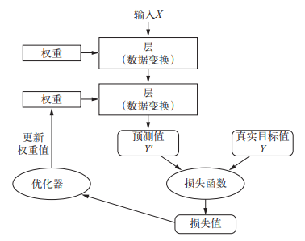
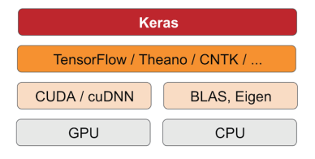

# Keras神经网络的基础

## 一、了解机器学习的四个分支
### 监督学习
- 分类
- 回归
- 序列生成，给定一张图像，预测描述图像的文字
- 语法树预测，给定一个句子，预测其分解生成的语法树
- 目标检测，给定一张图像，在图中特定目标的周围画上一个边界框
- 图像分割，给定一张图像，在特定物体上画一个像素级的掩模

### 无监督学习
常用于数据可视化、数据压缩、数据去噪或者更好的理解数据中的相关性
- 降维
- 聚类

### 自监督学习
没有人工标注标签的监督学习，比如根据给定文本中前面的词来预测下一个词

### 强化学习
接收环境信息，并学会选择使某种奖励最大化，如下围棋

## 二、张量（tensor）
张量这一概念的核心在于，它是一个数据容器；它包含的数据几乎总是数值数据，因此它
是数字的容器；你可能对矩阵很熟悉，它就是二维张量。张量是矩阵向任意维度的推广。  
张量的三个关键属性  
1）轴的个数（阶）， ndim  
2） 形状， shape。  
3）数据类型，dtype，Numpy（以及大多数其他库）中不存在字符串张量，因为张量存
储在预先分配的连续内存段中，而字符串的长度是可变的，无法用这种方式存储  

- 标量（0D 张量， scalar，也叫标量张量、零维张量）
```python
>>> import numpy as np
>>> x = np.array(12)
>>> x
array(12)
>>> x.ndim
0
```

- 向量（1D 张量， vector，一维张量）
```python
>>> x = np.array([12, 3, 6, 14, 7])
>>> x
array([12, 3, 6, 14, 7])
>>> x.ndim
1
```

- 矩阵（2D 张量，matrix）  
```python
>>> x = np.array([[5, 78, 2, 34, 0],
[6, 79, 3, 35, 1],
[7, 80, 4, 36, 2]])
>>> x.ndim
2
```
向量数据： 2D 张量，形状为 (samples, features)  
比如，人口统计数据集，其中包括每个人的年龄、邮编和收入。每个人可以表示为包含 3 个值
的向量，而整个数据集包含 100 000 个人，因此可以存储在形状为 (100000, 3) 的 2D
张量中

- 3D 张量与更高维张量
```python
>>> x = np.array([[[5, 78, 2, 34, 0],
[6, 79, 3, 35, 1],
[7, 80, 4, 36, 2]],
[[5, 78, 2, 34, 0],
[6, 79, 3, 35, 1],
[7, 80, 4, 36, 2]],
[[5, 78, 2, 34, 0],
[6, 79, 3, 35, 1],
[7, 80, 4, 36, 2]]])
>>> x.ndim
3
```
时间序列数据或序列数据： 3D 张量，形状为 (samples, timesteps, features)。比如，股票价格数据集，每一分钟，我们将股票的当前价格、前一分钟的最高价格和前一分钟
的最低价格保存下来。因此每分钟被编码为一个 3D 向量，整个交易日被编码为一个形
状为 (390, 3) 的 2D 张量（一个交易日有 390 分钟），而 250 天的数据则可以保存在一
个形状为 (250, 390, 3) 的 3D 张量中。这里每个样本是一天的股票数据  

- 4D 张量
图片，形状为 (samples, height, width, channels) 或 (samples, channels,
height, width)。比如，128张照片（256*256px）的彩色照片可以表示为(128, 256, 256, 3)；  

- 5D 张量
视频，形状为 (samples, frames, height, width, channels) 或 (samples,
frames, channels, height, width)，比如，一个以每秒 4 帧采样的 60 秒 YouTube 视频片段，视频尺寸为 144× 256，这个视频共有 240 帧。 4 个这样的视频片段组成的批量将保存在形状为 (4, 240, 144, 256, 3)的张量中  

### 张量的运算（参考矩阵运算）
- 逐元素运算，如，加减法，one by one 对齐齐
- 广播，维度不够，重复使用来凑，如，矩阵加一个常数中的常数
- 点积，如，矩阵乘法
- 变形，如转置

## 三、深度学习过程

想象有两张彩纸：一张红色，一张蓝色，将其中一张纸放在另一张上。现在将两张纸一起揉成小球。这个皱巴巴的纸球就是你的输入数据，每张纸对应于分类问题中的一个类别。深度学习，就是通过一序列的的变换来一点点展开小球。  

(1) 抽取训练样本 x 和对应目标y组成的数据批量
(2) 在x上运行网络，得到预测值y_pred
(3) 计算网络在这批数据上的损失，用于衡量y_pred和y之间的距离
(4) 计算损失相对于网络参数的梯度［一次反向传播（backward pass）］
(5) 将参数沿着梯度的反方向移动一点，比如 W -= step * gradient，从而使这批数据上的损失减小一点

### 层：多个层组合成网络（或模型）
常用的层有：
- 全连接层（ fully connected layer），也叫密集连接层（densely connected layer）、密集层（dense layer）
- 循环层（ recurrent layer，比如 Keras 的 LSTM 层）通常来处理形状为 (samples, timesteps, features) 的 3D 张量序列数据
- 卷积层（ Keras 的 Conv2D），通常用来处理保存在 4D 张量中的图像数据  
多层组成的网络结构可分为，
- 双分支（ two-branch）网络
- 多头（ multihead）网络
- Inception 模块
选择正确的网络架构更像是一门艺术

### 损失函数（ loss function）：用于学习的反馈信号，衡量在训练数据上的性能
损失函数，在训练过程中需要将其最小化。它能够衡量当前任务是否已成功完成。

### 优化器（ optimizer）：决定学习过程如何进行
优化器，决定如何基于损失函数对网络进行更新。它执行的是随机梯度下降（ SGD）的某个变体。

- 梯度
梯度（ gradient）是张量运算的导数。它是导数这一概念向多元函数导数的推广。多元函数
是以张量作为输入的函数
```python
y_pred = dot(W, x)
loss_value = loss(y_pred, y)
//如果输入数据x和y保持不变，那么这可以看作将W映射到损失值的函数
loss_value = f(W)
```
张量gradient(f)(W0)是函数f(W) = loss_value在W0的导数  
对于张量的函数 f(W)，你可以通过将W向梯度的反方向移动来减小f(W)，
比如 W1 = W0 - step * gradient(f)(W0)，其中 step 是一个很小的比例因子。
注意，比例因子step是必需的，因为gradient(f)(W0) 只是W0附近曲率的近似值，不能离W0太远

- 随机梯度下降可分为  
每次迭代取小批量的数据 —— 小批量SGD  
每次迭代取小批量的数据 —— 真SGD  
每一次迭代都在所有数据上运行 —— 批量SGD  

- SGD 还有多种变体  
区别在于计算下一次权重更新时还要考虑上一次权重更新，比如带动量的SGD、 Adagrad、RMSProp等变体。
这些变体被称为优化方法（ optimization method）或优化器（ optimizer）。
动量的概念源自物理学，动量解决了 SGD 的两个问题：收敛速度和局部极小点。动量方法的实现过程是每一步都移动小球，不仅要考虑当前的斜率值（当前的加速度），还要考虑当前的速度（来自于之前的加速度）。这在实践中的是指，更新参数 w 不仅要考虑当前的梯度值，还要考虑上一次的参数更新，

- 反向传播（ backpropagation，有时也叫反式微分， reverse-mode differentiation）  
将链式法则应用于神经网络梯度值的计算，得到的算法叫作反向传播。反向传播从最终损失值开始，从最顶层反向作用至最底层，利用链式法则计算每个参数对损失值的贡献大小

### 监控指标（metric）：在训练和测试过程中需要监控的指标

| 问题归类 | 损失函数                                                     | 优化器 | 监控指标 |
| -------- | ------------------------------------------------------------ | :----- | -------- |
| 二分类   | 二元交叉熵（binary crossentropy）                            |        |          |
| 多分类   | 分类交叉熵（categorical crossentropy）                       |        |          |
| 回归问题 | 均方误差（mean-squared error）                               |        |          |
| 序列学习 | 联结主义时序分类（CTC，connectionist temporal classification） |        |          |


## 四、Keras 简介

### Keras 是一个 Python 深度学习框架
可以方便地定义和训练几乎所有类型的深度学习模型
具有以下重要特性。
- 相同的代码可以在CPU或GPU上无缝切换运行
- 具有用户友好的API，便于快速开发深度学习模型的原型
- 内置支持卷积网络（用于计算机视觉）、循环网络（用于序列处理）以及二者的任意
组合
- 支持任意网络架构：多输入或多输出模型、层共享、模型共享等。这也就是说， Keras
能够构建任意深度学习模型，无论是生成式对抗网络还是神经图灵机  

### Keras 是一个模型级（ model-level）的库  

keras提供了一个高层次的构建模块  
Keras 有三个后端实现： TensorFlow 后端、Theano 后端和微软认知工具包（ CNTK， Microsoft cognitive toolkit）后端  
TensorFlow 本身封装了一个低层次的张量运算库，叫作 Eigen；在 GPU 上运行时， TensorFlow封装了一个高度优化的深度学习运算库，叫作 NVIDIA CUDA 深度神经网络库（ cuDNN）

### Keras的开发步骤
(1) 定义训练数据：输入张量和目标张量
(2) 定义层组成的网络（或模型），将输入映射到目标
(3) 配置学习过程：选择损失函数、优化器和需要监控的指标
(4) 调用模型的 fit 方法在训练数据上进行迭代
```python
from keras import models
from keras import layers
from keras import optimizers

model = models.Sequential()
model.add(layers.Dense(32, activation='relu', input_shape=(784,)))
model.add(layers.Dense(10, activation='softmax'))
model.compile(optimizer=optimizers.RMSprop(lr=0.001), 
				   loss='mse',
				metrics=['accuracy'])
model.fit(input_tensor, target_tensor, batch_size=128, epochs=10)


// 下面是用函数式 API 定义的相同模型。
input_tensor = layers.Input(shape=(784,))
x = layers.Dense(32, activation='relu')(input_tensor)
output_tensor = layers.Dense(10, activation='softmax')(x)
model = models.Model(inputs=input_tensor, outputs=output_tensor)
```

## 五、quickly start

| Case场景 | 数据            | 数据结构（x.shape, y.shape）                                 | 网络结构                                                     | 优化器  | 损失函数                 | 监控指标 |
| -------- | --------------- | ------------------------------------------------------------ | ------------------------------------------------------------ | ------- | ------------------------ | -------- |
| 多分类   | MNIST手写字识别 | train: (60000, 28, 28) (60000,)<br/> test: (10000, 28, 28) (10000,) | (512, activation='relu', input_shape=(28 * 28,))<br/>(10, activation='softmax') | rmsprop | categorical_crossentropy | accuracy |
| 二分类   | 电影评论IMDB    | train: (25000,) (25000,)<br/> test: (25000,) (25000,) | (16, activation='relu', input_shape=(10000,))<br/>(16, activation='relu')<br/>(1, activation='sigmoid') | rmsprop | binary_crossentropy      | accuracy |
| 多分类   | 新闻分类        | train: (8982,) (8982,)<br/> test: (2246,) (2246,)   | (64, activation='relu', input_shape=(10000,))<br/>(64, activation='relu')<br/>(46, activation='softmax') | rmsprop | categorical_crossentropy | accuracy |
| 回归问题 | 房价预测        | train: (404, 13) (404,) <br/>test: (102, 13) (102,) | (64, activation='relu', input_shape=(13,)<br/>(64, activation='relu')<br/>(1) | rmsprop | mse                      | mae      |

| 问题类型          | 最后一层激活函数 | 损失函数                 |
| ----------------- | ---------------- | ------------------------ |
| 二分类            | sigmoid          | binary_crossentropy      |
| 多分类、单标签    | softmax          | categorical_crossentropy |
| 多分类、多标签    | sigmoid          | binary_crossentropy      |
| 回归到任意值      | 无               | mse                      |
| 回归到0-1范围的值 | sigmoid          | mse或binary_crossentropy |

## 六、过拟合与欠拟合
### 过拟合，泛化能力不强
- 最优的解决办法是获取更多的训练数据
- 减小网络大小
- 添加权重正则化
- 添加dropout正则化
在训练过程中随机将该层的一些输出特征舍弃（设置为0），在层的输出值中引入噪声，打破不显著的偶然模式
### 欠拟合，模型能力不强
- 添加更多的层
- 让每一层更大
- 训练更多的轮次


> 参考文章  
[Keras文档](https://keras.io/)  
[Keras中文文档](https://keras.io/zh/)


-----------------------------------------------------------------------------------------

第9 章　总结
9.1　重点内容回顾
9.1.1　人工智能的各种方法
9.1.2　深度学习在机器学习领域中的特殊之处
9.1.3　如何看待深度学习
9.1.4　关键的推动技术
9.1.5　机器学习的通用工作流程
9.1.6　关键网络架构
9.1.7　可能性空间
9.2　深度学习的局限性
9.2.1　将机器学习模型拟人化的风险
9.2.2　局部泛化与极端泛化
9.2.3　小结
9.3　深度学习的未来
9.3.1　模型即程序
9.3.2　超越反向传播和可微层
9.3.3　自动化机器学习
9.3.4　终身学习与模块化子程序复用
9.3.5　长期愿景
9.4　了解一个快速发展领域的最新进展
9.4.1　使用Kaggle 练习解决现实世界的问题
9.4.2　在arXiv 阅读最新进展
9.4.3　探索Keras 生态系统
9.5　结束语