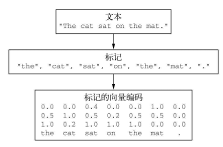
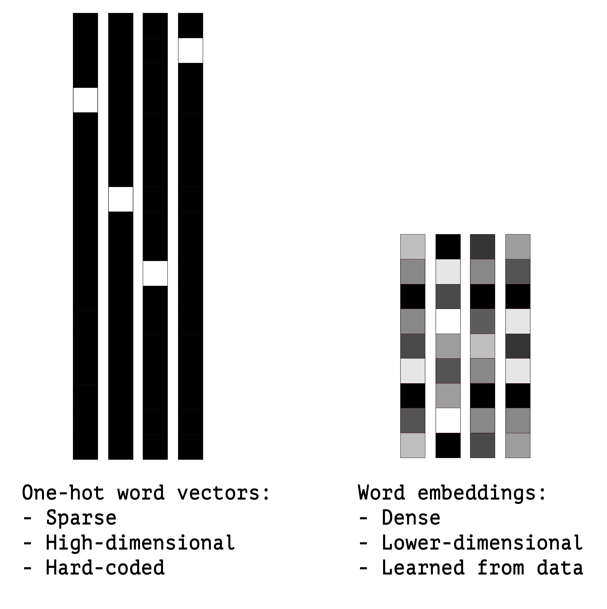

[TOC]
本篇涉及的内容

- 如何对文本分词

- 什么是词嵌入，如何使用词嵌入

- 什么是循环网络，如何使用循环网络

- 如何堆叠 RNN 层和使用双向 RNN，以构建更加强大的序列处理模型

- 如何使用一维卷积神经网络来处理序列

- 如何结合一维卷积神经网络和 RNN 来处理长序列

# 第一部分 文本处理

## 一、处理文本数据

深度学习模型不会接收原始文本作为输入，它只能处理数值张量。文本数据向量化的几种思路
- 文本分割成单词，单词向量化
- 文本分割成字符，字符向量化
- 文本分割成单词或字符，提取n-gram，将每个n-gram向量化
n-gram是从句子中提取N个或更少的连续单词的集合，如对于句子a b c d， 2-gram提取的集合是{a, ab, b, bc, c, cd, d}，该集合叫二元语法袋 




文本向量化的常用方法 —— one-hot编码、词向量

文本向量化的常用方法 —— one-hot编码、词向量

### 1.1 one-hot 编码

- one-hot 
常见方案，将单词按照01形式编排，举个例[北京、上海、广州、深圳]，二进制one-hot编码为[0001, 0010, 0100, 1000]；
典型的特征是：高纬、稀疏、忽略文本中单词之间的顺序
```
from keras.preprocessing.text import Tokenizer

samples = ['The cat sat on the mat.', 'The dog ate my homework.']

tokenizer = Tokenizer(num_words=1000)
tokenizer.fit_on_texts(samples)

one_hot_results = tokenizer.texts_to_matrix(samples, mode='binary')
print('texts_to_matrix')
print(one_hot_results.shape)
print(one_hot_results)
```

- 散列one-hot
散列是为了解决one-hot高纬稀疏的问题，人为的加上一层hash映射，降维的问题是可能会有单词hash值相同，造成数据丢失
```
samples = ['The cat sat on the mat.', 'The dog ate my homework.']

dimensionality = 8
max_length = 10

results = np.zeros((len(samples), max_length, dimensionality))
for i, sample in enumerate(samples):
    for j, word in list(enumerate(sample.split()))[:max_length]:
        index = abs(hash(word)) % dimensionality
        results[i, j, index] = 1.
print(results)
```

### 1.2 Word Embedding词向量

因为one-hot编码得到的向量是稀疏的、高维的、硬编码的，且不会考虑词与词之间的联系，所以有了词向量。
词向量是相对低维的密集浮点数向量，且从数据中学习得到的，常见的维度只有256、512、1024



- 理解词向量

词向量之间的关系（距离、方向）表示这些词之间的语义关系。
举个例子，
  

从cat到tiger的向量应该与从dog到wolf的向量相等，这个向量可以被解释为“从宠物到野生动物”向量；
同样，从dog到cat的向量与从wolf到tiger的向量也相等，它可以被解释为“从犬科到猫科”向量

获取词嵌入有两种方法

* 在网络中增加Embedding层，在完成主任务的时候同时学习词嵌入
```
from keras.layers import Dense
from keras.layers import Embedding
from keras.layers import Flatten
from keras.models import Sequential

model = Sequential()
model.add(Embedding(10000, 100, input_length=maxlen))
# `(samples, maxlen, 8)` into `(samples, maxlen * 8)`
model.add(Flatten())
model.add(Dense(1, activation='sigmoid'))
model.compile(optimizer='rmsprop', loss='binary_crossentropy', metrics=['acc'])
model.summary()
keras.utils.plot_model(model, "../../pic/model.png", show_shapes=True)

history = model.fit(x_train, y_train,
                    epochs=10,
                    batch_size=32,
                    validation_split=0.2)
```

* 将其他预训练好的词嵌入，直接用于模型，常用的两种预训练词嵌入（ pretrained word embedding）  
    * word2vec
    * GloVe（global vectors for word representation）

下载并解析glove词向量
```
# 加载词向量
# https://nlp.stanford.edu/projects/glove
# 这是一个822 MB的压缩文件，文件名是glove.6B.zip，里面包含400000个单词（或非单词的标记）的100维嵌入向量
glove_dir = 'D:\\doc\\data\\glove.6B'

embeddings_index = {}
f = open(os.path.join(glove_dir, 'glove.6B.100d.txt'), encoding='UTF-8')
for line in f:
    values = line.split()
    word = values[0]
    coefs = np.asarray(values[1:], dtype='float32')
    embeddings_index[word] = coefs
f.close()

print('Found %s word vectors.' % len(embeddings_index), len(embeddings_index['the']))
```
从所有的词里面选出当前任务所需要的词
```
# 加载预训练好的embedding
# 从40万里面选出当前1万个词的向量，没找到则填0
embedding_dim = 100

embedding_matrix = np.zeros((max_words, embedding_dim))
for word, i in word_index.items():
    embedding_vector = embeddings_index.get(word)
    if i < max_words:
        if embedding_vector is not None:
            # Words not found in embedding index will be all-zeros.
            embedding_matrix[i] = embedding_vector
```
将embedding_matrix加入网络的第一层，设置第一层不需要训练
``` python
from keras.models import Sequential
from keras.layers import Embedding, Flatten, Dense

model = Sequential()
model.add(Embedding(max_words, embedding_dim, input_length=maxlen))
model.add(Flatten())
model.add(Dense(32, activation='relu'))
model.add(Dense(1, activation='sigmoid'))
model.summary()
# 设置好第一层
model.layers[0].set_weights([embedding_matrix])
model.layers[0].trainable = False
model.compile(optimizer='rmsprop',
              loss='binary_crossentropy',
              metrics=['acc'])
history = model.fit(x_train, y_train,
                    epochs=10,
                    batch_size=32,
                    validation_split=0.2)
```


# 第二部分 循环神经网络
## 一、基本使用场景

- 文档分类和时间序列分类，比如识别文章的主题或书的作者
- 时间序列对比，比如估测两个文档或两支股票行情的相关程度
- 序列到序列的学习，比如将英语翻译成法语
- 情感分析，比如将推文或电影评论的情感划分为正面或负面
- 时间序列预测，比如根据某地最近的天气数据来预测未来天气

使用场景不包括对市场的预测，因为面对市场时，过去的表现并不能很好地预测未来的收益

## 二、理解循环神经网络RNN

区别于传统的网络结构，RNN增加了一个状态（state），每次处理的时候输入为本次输入+当前状态


```python
state_t = 0 
for input_t in input_sequence: 
	output_t = f(input_t, state_t)
	state_t = output_t
```
在处理两个不同的独立序列（比如两条不同的IMDB评论）之间，RNN状态会被重置，所以真正改变的是，处理单条序列数据的时候，数据点不再是在单个步骤中进行处理，网络内部会对序列元素进行遍历

### 2.1 RNN

循环神经网络（RNN、recurrent neural network）是具有内部环的神经网络，上一层的输出作为下一层的状态输入，状态输入+本层输入得到本层输出


```
# demo，表示需要返回每个时间步连续输出的完整序列
from keras.models import Sequential
from keras.layers import Embedding, SimpleRNN

model = Sequential()
model.add(Embedding(10000, 32))
model.add(SimpleRNN(32, return_sequences=True))
model.add(SimpleRNN(32, return_sequences=True))
model.add(SimpleRNN(32))  # This last layer only returns the last outputs.
model.summary()
```


### 2.2 LSTM

随着层数的增加容易出现**梯度消失**，增加网络层数将变得无法训练，继而就有了长短期记忆（LSTM，long short-term memory)
LSTM增加了一种携带信息跨越多个时间步的方法 —— Ct


增加计算的环节

理解一下，
假设有一条传送带，其运行方向平行于你所处理的序列，序列中的信息可以在任意位置跳上传送带，然后被传送到更晚的时间步，并在需要时原封不动地跳回来，是不是可以解决层数增加导致的信息丢失问题。
总之，不要求理解关于LSTM单元具体架构的任何内容，只需要记住 LSTM单元的作用 —— 允许过去的信息稍后重新进入，从而解决梯度消失问题
```
from keras.layers import LSTM

model = Sequential()
model.add(Embedding(max_features, 32))
model.add(LSTM(32))
model.add(Dense(1, activation='sigmoid'))

model.compile(optimizer='rmsprop',
              loss='binary_crossentropy',
              metrics=['acc'])
history = model.fit(input_train, y_train,
                    epochs=10,
                    batch_size=128,
                    validation_split=0.2)
```

### 2.3 GRU

门控循环单元（GRU，gated recurrent unit）层的工作原理与 LSTM相同，但它做了一些简化，运行的计算代价更低，效果可能不如LSTM
```
from keras import layers

model.add(layers.GRU(32, input_shape=(None, float_data.shape[-1])))
```


## 三、循环神经网络的高级用法

### 3.1 循环dropout

使用循环dropout(recurrent dropout) 将某一层的输入单元随机设为0，其目的是打破该层训练数据中的偶然相关性，降低网络的过拟合。
为了对GRU、LSTM等循环层得到的表示做正则化，应该将不随时间变化的dropout掩码应用于层的内部循环激活。使用相同的dropout掩码，可以让网络沿着时间正确地传播其学习误差，而随时间随机变化的dropout掩码则会破坏这个误差信号，并且不利于学习过程。
```
from keras.models import Sequential
from keras import layers
from keras.optimizers import RMSprop

model = Sequential()
model.add(layers.GRU(32,
                     dropout=0.2,
                     recurrent_dropout=0.2,
                     input_shape=(None, float_data.shape[-1])))
model.add(layers.Dense(1))

model.compile(optimizer=RMSprop(), loss='mae')
model.summary()
```

### 3.2 堆叠循环层

堆叠循环层(stacking recurrent layers) 可以提高网路表达能力。增加网络容量的通常做法是 —— 增加每层单元数或增加层数。
在过拟合不是很严重的时候，可以放心地增大每层的大小、层数，但这么做的计算成本很高。
```
from keras.models import Sequential
from keras import layers
from keras.optimizers import RMSprop

model = Sequential()
model.add(layers.GRU(32,
                     dropout=0.1,
                     recurrent_dropout=0.5,
                     return_sequences=True,
                     input_shape=(None, float_data.shape[-1])))
# 堆叠➕一层
model.add(layers.GRU(64, activation='relu',
                     dropout=0.1, 
                     recurrent_dropout=0.5))
model.add(layers.Dense(1))

model.compile(optimizer=RMSprop(), loss='mae')
model.summary()
```


### 3.3 双向循环层

双向循环层 (directional recurrent layer) 是一种常见的RNN变体，在某些任务上的性能比普通RNN更好，常用于自然语言处理，可谓深度学习对自然语言处理的瑞士军刀。
双向循环层包含两个普通RNN，每个RNN分别沿一个方向对输入序列进行处理（时间正序和时间逆序），然后将它们的表示合并在一起，通过沿这两个方向处理序列，双向RNN能够捕捉到可能被单向RNN忽略的模式


```
from keras.models import Sequential
from keras import layers
from keras.optimizers import RMSprop

model = Sequential()
model.add(layers.Bidirectional(
    layers.GRU(32), input_shape=(None, float_data.shape[-1])))
model.add(layers.Dense(1))

model.compile(optimizer=RMSprop(), loss='mae')
history = model.fit_generator(train_gen,
                              steps_per_epoch=500,
                              epochs=40,
                              validation_data=val_gen,
                              validation_steps=val_steps)
```

### 3.4 更多尝试

- 在堆叠循环层中调节每层的单元个数，网络结构的设计，高深莫测
- 调节RMSprop优化器的学习率
- 尝试使用LSTM层代替GRU层
- 在循环层上面尝试使用更大的密集连接回归器，即更大的Dense层或Dense层的堆叠

# 第三部分 使用一维卷积神经网络

## 一、理解序列数据的一维卷积
一维卷积神经网络在处理时间模式时表现很好，对于某些问题，特别是自然语言处理任务，可以替代RNN，并且速度更快


每个输出时间步都是利用输入序列在时间维度上的一小段得到的，这种一维卷积层可以识别到序列中的局部模式
通常情况下，一维卷积神经网络的架构与计算机视觉领域的二维卷积神经网络很相似，它将Conv1D层和MaxPooling1D层堆叠在一起，最后是一个全局池化运算或展平操作
```
from keras.models import Sequential
from keras import layers
from keras.optimizers import RMSprop

model = Sequential()
model.add(layers.Embedding(max_features, 128, input_length=max_len))
model.add(layers.Conv1D(32, 7, activation='relu'))
model.add(layers.MaxPooling1D(5))
model.add(layers.Conv1D(32, 7, activation='relu'))
model.add(layers.GlobalMaxPooling1D())
model.add(layers.Dense(1))

model.summary()

model.compile(optimizer=RMSprop(lr=1e-4),
              loss='binary_crossentropy',
              metrics=['acc'])
history = model.fit(x_train, y_train,
                    epochs=10,
                    batch_size=128,
                    validation_split=0.2)
```

## 二、结合CNN和RNN来处理长序列

RNN在处理非常长的序列时计算代价很大，一维卷积神经网络的计算代价很小，所以在RNN之前使用一维卷积神经网络作为预处理步骤可以使序列变短，并提取出有用的表示交给RNN来处理


```
from keras.models import Sequential
from keras import layers
from keras.optimizers import RMSprop

model = Sequential()
model.add(layers.Conv1D(32, 5, activation='relu',
                        input_shape=(None, float_data.shape[-1])))
model.add(layers.MaxPooling1D(3))
model.add(layers.Conv1D(32, 5, activation='relu'))
model.add(layers.MaxPooling1D(3))
model.add(layers.Conv1D(32, 5, activation='relu'))
model.add(layers.GlobalMaxPooling1D())
model.add(layers.Dense(1))
model.summary()
model.compile(optimizer=RMSprop(), loss='mae')
history = model.fit_generator(train_gen,
                              steps_per_epoch=500,
                              epochs=20,
                              validation_data=val_gen,
                              validation_steps=val_steps)
```


> 参考文章&图书    

《Python深度学习》


> @ WHAT - HOW - WHY

