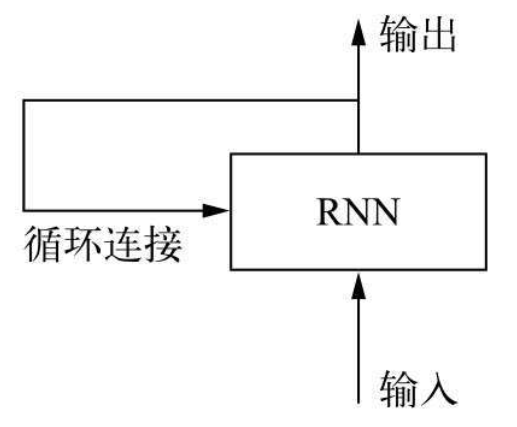
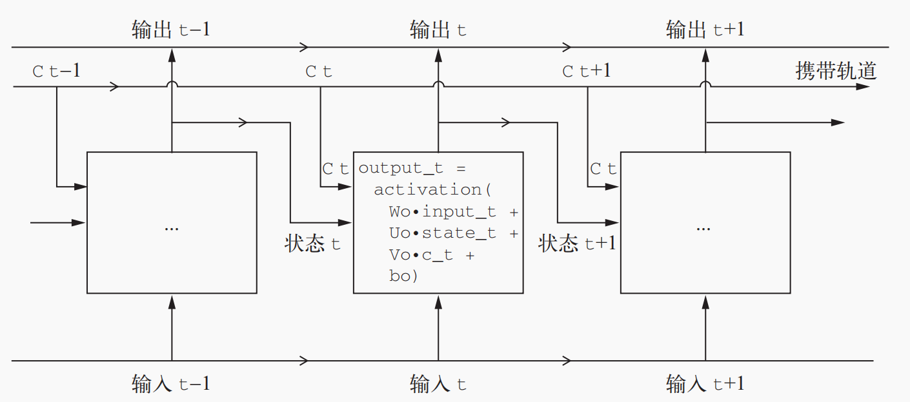
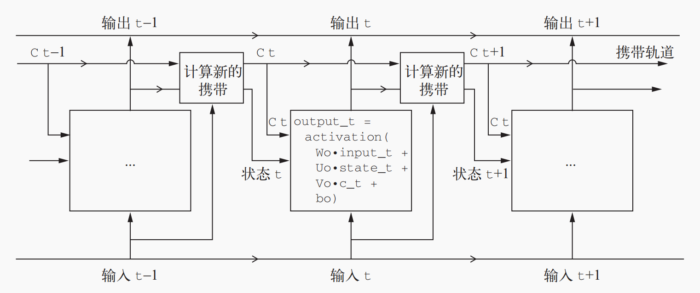

[TOC]

# 第一部分 文本处理
## 一、处理文本数据
深度学习模型不会接收原始文本作为输入，它只能处理数值张量，文本向量化的几种思路
- 文本分割成单词，单词向量化
- 文本分割成字符，字符向量化
- 文本分割成单词或字符，提取n-gram，将每个n-gram向量化（n-gram是从句子中提取N个或更少的连续单词的集合，如对于句子a b c d， 2-gram提取的集合是{a, ab, b, bc, c, cd, d}，该集合叫二元语法袋）  


### 1.1 one-hot 编码
- one-hot

有分字符级和单词级


- 散列one-hot

### 1.2 词向量Word Embedding

因为one-hot编码得到的向量是稀疏的、高维的、硬编码的，且不会考虑词与词之间的联系，所以有了词向量

而词嵌入是相对低维的密集浮点数向量，且从数据中学习得到的 ，常见的维度只有256、512、1024


- 理解词向量

词向量之间的关系（距离、方向）表示这些词之间的语义关系

  

从cat到tiger的向量与从dog到wolf的向量相等，这个向量可以被解释为“从宠物到野生动物”向量。

同样，从dog到cat的向量与从wolf到tiger的向量也相等，它可以被解释为“从犬科到猫科”向量


获取词嵌入有两种方法

* 直接在网络中增加Embedding层，在完成主任务的时候同时学习词嵌入

* 直接将其他预训练好的词嵌入，直接用于模型，预训练词嵌入（ pretrained word embedding）  
    * word2vec
    * GloVe（global vectors for word representation，词表示全局向量）

### 1.3 整合在一起：从原始文本到词嵌入


# 第二部分 循环神经网络
## 一、基本使用场景

- 文档分类和时间序列分类，比如识别文章的主题或书的作者
- 时间序列对比，比如估测两个文档或两支股票行情的相关程度
- 序列到序列的学习，比如将英语翻译成法语
- 情感分析，比如将推文或电影评论的情感划分为正面或负面
- 时间序列预测，比如根据某地最近的天气数据来预测未来天气

## 二、理解循环神经网络

遍历所有序列元素，并保存一个状态（state），每次处理的时候输入为本次输入+当前状态，在处理两个不同的独立序列（比如两条不同的IMDB评论）之间，RNN状态会被重置，因此，你仍可以将一个序列看作单个数据点，即网络的单个输入。真正改变的是，数据点不再是在单个步骤中进行处理，相反，网络内部会对序列元素进行遍历




```python
state_t = 0 
for input_t in input_sequence: 
	output_t = f(input_t, state_t)
	state_t = output_t
```

### 2.1 RNN

循环神经网络（RNN、recurrent neural network）是具有内部环的神经网络，上一层的输出作为下一层的状态输入，状态输入+本层输入得到本层输出


### 2.2 LSTM

随着层数的增加容易出现梯度消失，增加网络层数将变得无法训练，继而就有了长短期记忆（LSTM，long short-term memory)。LSTM增加了一种携带信息跨越多个时间步的方法。





LSTM 层是 SimpleRNN 层的一种变体，它增加了一种携带信息跨越多个时间步的方法。假

设有一条传送带，其运行方向平行于你所处理的序列。序列中的信息可以在任意位置跳上传送带，

然后被传送到更晚的时间步，并在需要时原封不动地跳回来。这实际上就是 LSTM 的原理：它

保存信息以便后面使用，从而防止较早期的信号在处理过程中逐渐消失。


总之，你不需要理解关于 LSTM 单元具体架构的任何内容。作为人类，理解它

不应该是你要做的。你只需要记住 LSTM 单元的作用：允许过去的信息稍后重新进入，从而解

决梯度消失问题

### 2.3 GRU

## 三、循环神经网络的高级用法

### 3.1循环dropout

使用循环dropout (recurrent dropout) 降低过拟合


### 3.2 堆叠循环层

堆叠循环层(stacking recurrent layers) 提高网路表达能力


### 3.3 双向循环层

双向循环层 (directional recurrent layer) 将相同的信息以不同的方式呈现给循环网络，

可以提高精度并缓解遗忘问题


# 第三部分 使用一维卷积神经网络

## 一、用卷积神经网络处理序列
时间可以理解为一个空间维度
### 理解序列数据的一维卷积

### 序列数据的一维池化
### 实现一维卷积神经网络
### 结合CNN 和RNN 来处理长序列


> @ WHAT - HOW - WHY